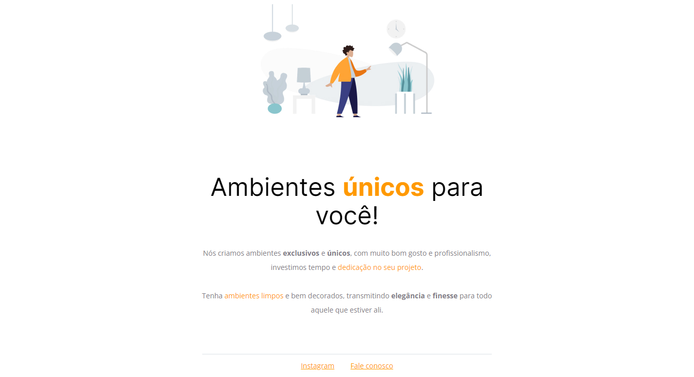

  

	
<h4 align="center"> 
	🚀 Projeto 01 | Stage 02 - Explorer
</h4>

  

  
  
  
  
  <a href="https://laurirodrigues.github.io/Page-Moveis-para-voce/"> ▶️ Visualizar Deploy </a>

<h2 align=left> 💻 Sobre o projeto </h3>

 Página feita durante o programa <strong>Explorer</strong> da <a href="https://www.rocketseat.com.br/"> <strong>Rocketseat</strong> </a>. É o primeiro projeto do nível 2 do programa, onde construímos uma página simples para demonstração de conceitos básicos de HTML e CSS.

  
<h2 align=left> 🛠 Tecnologias utilizadas </h3>

  
  

<h2 align=left> 🎨 Layout </h2>
<a href="https://www.figma.com/file/ZKlgJZgHnmanJfzxwQDU4n/Explorer---Projeto-01-(Copy)?node-id=0%3A1"> Visualizar no Figma </a>

<h4>💻 Desktop </h4>

